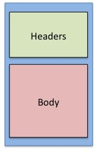
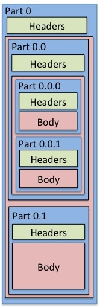
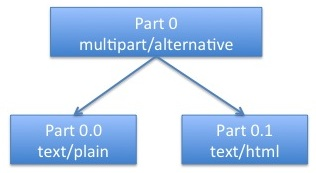

# Pantomime Manual

Pantomime is a Java library for parsing and manipulating MIME email messages.

Please read [Read Me First](#ReadMeFirst) to get started.

## Table of Contents

* [Read Me First](#ReadMeFirst)
* [Why Pantomime?](#WhyPantomime)
* [Installation](#installation)
* [Getting Help](#gettingHelp)
* [Simple Cookbook](#SimpleCookbook)
	+ [New plain text or HTML message](#plainOrHtml)
	+ [New plain text and HTML message](#plainAndHtml)
	+ [Load a message from a file](#loadFromFile)
	+ [Load a message from a database](#loadFromDatabase)
	+ [Load a message from a JavaMail MimeMessage](#loadFromJavaMail)
	+ [Archive a message to file](#archive)
	+ [Send a message via SMTP](#sendMessage)
* [MIME For Email](#mime)
* [Intermediate Cookbook](#IntermediateCookbook)
 	+ [New plain text and HTML message with inline images](#plainAndHtmlAndImage)
 	+ [Get content](#getContent)
	+ [Manipulate headers](#manipulateHeaders)
	+ [Carbon copy a message](#copyMessage)
 	+ [Getting The Size Of Message](#messageSize)
 	+ [Finding Oversized Attachments](#oversizedAttachments)
	+ [Add an attachment](#addAttachment)
* [Advanced Cookbook](#advancedCookbook)
	+ [Searching for sensitive data in email](#search)
	+ [Add a footer](#addFooter)
	+ [Remove attachment](#removeAttachment)
	+ [Change attachment filename](#changeAttachment)

## <a id="ReadMeFirst">Read Me First</a>

Pantomime is a Java library for parsing and manipulating MIME email messages.

Pantomime is replacement for the MIME-manipulation features of [JavaMail](http://www.oracle.com/technetwork/java/javamail/index.html).

Pantomime is:

- robust
- memory efficient
- easier to use.

Download Pantomime from <https://bitbucket.org/barbee/pantomime/downloads>.

Pantomime is licensed under [Mozilla Public License v 2.0](http://mozilla.org/MPL/2.0/)

Pantomime is written by [JH Barbee](http://www.linkedin.com/in/jhbarbee)

The API documentation is available at [http://barbee.bitbucket.org/pantomime/javadocs/](http://barbee.bitbucket.org/pantomime/javadocs/)

This manual serves to instruct you on how to use Pantomime.

You do not need to read the entire manual to get started.

* If you are impatient, go straight to the [Simple Cookbook](#SimpleCookbook).
* If you are wondering why you should use Pantomime over JavaMail, please read [Why Pantomime?](#WhyPantomime).
* For installation help, read [Installation](#Installation)
* Should you need to reference the [Intermediate Cookbook](#IntermediateCookbook) or [Advanced Cookbook](#AdvancedCookbook), it is recommended that you review [MIME For Email](#mime) first.

## <a id="WhyPantomime">Why Pantomime?</a>

Next to JavaMail, Pantomime is more robust, memory efficient, and is more convenient.

### Robustness

JavaMail is adequate for a great majority of eamil. However, it often falls short, especially with real-world messages that veer slightly from RFC compliance.

**Example 1**

	From: ernie@sesame.edu
	To: bert@sesame.edu
	Subject: Dishes
	Content-Type: multipart/alternative
	
	You didn't wash the dishes last night.
	
JavaMail will throw a MessagingException due to a missing start boundary. Your recourse is to reconfigure JavaMail to allow for non-compliance or modify the text to fix the boundary. 

Reconfiguring JavaMail would only go so far since JavaMail is rather strict. This wouldn't solve all your problems.

To fix the boundary, you would need to write a lot of code to handle all the edge cases, since there are so many ways to break boundaries.

Pantomime will parse this message without a problem.

**Example 2**

	From: bert@sesame.edu
	To: ernie@sesame.edu
	Subject: Re: Dishes
	Content-Type: text/plain; charset="US-ASCII"
	
	It wasn't my turn.
	
JavaMail will throw an UnsupportedEncodingException since it does not understand US-ASCII as a valid character set.

Pantomime, instead, will make a best effort to parse this somehow.

**Example 3**

	From: ernie@sesame.edu
	To: bigBird@sesame.edu, elmo@@sesame.edu
	Subject: Fwd: Dishes
	Content-Type: text/plain
	
	Big Bird,
	
	  Can you talk to Bert? Our sink is overflowing.
	  
	Ernie.
	
JavaMail will fail the entire message with an AddressException because of the extra @ in Elmo's email address.

Pantomime, instead, will make note of the invalid address and allow you to continue. You can use the Pantomime API to check the validity of addresses and decide programmatically what you want to do.

### Memory Efficient

JavaMail will throw an OutOfMemoryException for large messages. By large messages we mean anything over 20 - 30 MB. The exception is rooted in proprietary *com.sun* classes that will load data into a byte array in memory, *even if you provided the content as an input stream*. There is not much you can do here.

Used properly, Pantomime can handle messages of any size as it is inherently stream-based.

### Convenient

To create a *text/plain* message with JavaMail, you would need to do this.

	Session session = Session.getDefaultInstance(new Properties());
	MimeMessage mime = new MimeMessage(session)
	mime.setFrom(new InternetAddress("ernie@sesame.edu"));
	mime.setSubject("Re: Dishes");
	mime.setText("We need to talk.", "utf-8", "plain")

In contrast, Pantomime ships with a [collection of static utility methods](http://barbee.bitbucket.org/pantomime/javadocs/org/blackmist/pantomime/Pantomime.html) that allow you to do this with one call.

	Pantomime.plain("ernie@sesame.edu", "Re: Dishes", "We need to talk.", "bert@sesame.edu");
	
Supposing you want to allow rich-text formatting in this email and you would want to create a *multipart/alternative* message instead. (If you are not sure what *multipart/alternative* is, please review  [MIME For Email](#mime).)

In JavaMail

	Session session = Session.getDefaultInstance(new Properties());
	MimeMessage mime = new MimeMessage(session)
    MimeBodyPart plain = new MimeBodyPart();
    MimeBodyPart html = new MimeBodyPart();
    MimeMultipart alternative = new MimeMultipart();

    plain.setText("We need to talk.", "utf-8", "plain")
    html.setText("<b>We need to talk.</b>", "utf-8", "html")

    alternative.addBodyPart(plain)
    alternative.addBodyPart(html)
    alternative.setSubType('alternative')

	mime.setContent(alternative)
	mime.setFrom(new InternetAddress("ernie@sesame.edu"));
	mime.setSubject("Re: Dishes");

With Pantomime it is still just one method call.

	Pantomime.alternative("ernie@sesame.edu", "Re: Dishes", 
		"We need to talk.", "<b>We need to talk.</b>", 
		"bert@sesame.edu");

For our last contrast of Pantomime's convenience versus JavaMail, we will illustrate the difference when we add an attachment to the message.

In JavaMail

	Session session = Session.getDefaultInstance(new Properties());
	MimeMessage mime = new MimeMessage(session)
    MimeBodyPart plain = new MimeBodyPart();
    MimeBodyPart html = new MimeBodyPart();
    MimeMultipart alternative = new MimeMultipart();
    MimeBodyPart alternativeContainer  = new MimeBodyPart();
    MimeBodyPart attachment   = new MimeBodyPart();
	MimeMultipart mixed = new MimeMultipart();
	FileDataSource dataSource;

    plain.setText("We need to talk.", "utf-8", "plain");
    html.setText("<b>We need to talk.</b>", "utf-8", "html");

    alternative.addBodyPart(plain);
    alternative.addBodyPart(html);
    alternative.setSubType('alternative');

	alternativeContainer.setContent(alternative);
	
	dataSource = new FileDataSource("expenses.csv");
	
    attachment.setDataHandler(new DataHandler(dataSource));
    attachment.setDisposition(javax.mail.Part.ATTACHMENT)

	mixed.addBodyPart(alternative);
	mixed.addBodyPart(attachment);

	mime.setContent(mixed)
	mime.setFrom(new InternetAddress("ernie@sesame.edu"));
	mime.setSubject("Re: Dishes");

In Pantomime, you need just two lines.

	Message message = Pantomime.alternative("ernie@sesame.edu", 
		"Re: Dishes", "We need to talk.", 
		"<b>We need to talk.</b>", "bert@sesame.edu");

	message.addAttachment("expenses.csv")

## <a id="installation">Installation</a>

To install Pantomime, download the latest distribution from [https://bitbucket.org/barbee/pantomime/downloads](https://bitbucket.org/barbee/pantomime/downloads) and drop it into your classpath next to the JavaMail jar.

Remember that Pantomime is a replacement **only** for JavaMail's MIME-manipulation features. JavaMail is still required if you want to send the message.

Pantomime also requires [SLF4J](http://www.slf4j.org/) for logging. You choose which logging you want.

## <a id="gettingHelp">Getting Help</a>

If you find a bug, please file it at [https://bitbucket.org/barbee/pantomime/issues](https://bitbucket.org/barbee/pantomime/issues?status=new&status=open).

If you have questions, please post to [http://stackoverflow.com/](http://stackoverflow.com/)

## <a id="SimpleCookbook">Simple Cookbook</a>

### <a id="plainOrHtml">New plain text or HTML message</a>

To create a plain text message, use the [Pantomime convenience API](http://barbee.bitbucket.org/pantomime/javadocs/org/blackmist/pantomime/Pantomime.html).

	import org.blackmist.pantomime.Pantomime;

	Pantomime.plain("from@address.com", "subject", 
		"body", "to@address.com");

Here is another example where the body comes from a file and there are multiple recipients.

	import org.blackmist.pantomime.Pantomime;

	String[] toAddresses = {"to@address1.com", "to@address2.com"};
	String[] ccAddresses = {"cc@address1.com", "cc@address2.com"};
	Pantomime.plain("from@address.com", "subject", new File("body.txt"), 
		toAddresses, ccAddressses);
	
In addition to String and File, the [Pantomime convenience API](http://barbee.bitbucket.org/pantomime/javadocs/org/blackmist/pantomime/Pantomime.html) also accepts the body as an InputStream.
	
To send a rich-text HTML message instead of plain text, simply call html() instead.

	import org.blackmist.pantomime.Pantomime;

	Pantomime.html("from@address.com", "subject", 
		"<b>body<b>", "to@address.com");

### <a id="plainAndHtml">New plain text and HTML message</a>

People like sending email in rich text format with fonts, colors, and
layout. HTML has become the *de facto* standard for such. However,
what if the recipient has an email client that cannot display HTML?
They need to take your HTML, save it out to a file, and open it in a 
browser. It's a pain.

With *multipart/alternative*, you send both plain text and HTML. If the recipient has an older email client, they can still read the the text. If you want rich text definitely go with alternative content or
[related content](#plainAndHtmlAndImage) content instead of HTML only.

To send *multipart/alternative* with Pantomime, use the [Pantomime convenience API](http://barbee.bitbucket.org/pantomime/javadocs/org/blackmist/pantomime/Pantomime.html).

	import org.blackmist.pantomime.Pantomime;

	Pantomime.alternative("from@address.com", "subject", 
		"plain body", "<b>html body<b>", "to@address.com");

Like Pantomime.plain() and Pantomime.html(), Pantomime.alternative() will accept a String, File, or InputStream for plain and HTML bodies, in any combination. 

### <a id="loadFromFile">Load a message from a file</a>

Our previous example involves creating new messages. What if you want to load an existing message?

Here is how to load a message from file using Pantomime.

	import java.io.File;
	import org.blackmist.pantomime.FileMessageSource;
	import org.blackmist.panotmime.SourcedMessage;
	
	File emailFile = new File("message.eml")
	
	FileMessageSource source = new FileMessageSource(emailFile);
	SourcedMessage message = null;
	
	try {
		message = source.load();
	} finally {
		Pantomime.free(message);
	}

The [SourcedMessage class](http://barbee.bitbucket.org/pantomime/javadocs/org/blackmist/pantomime/SourcedMessage.html) inherits from [Message](http://barbee.bitbucket.org/pantomime/javadocs/org/blackmist/pantomime/Message.html), so you have access to all the same methods. 

### <a id="loadFromDatabase">Load a message from a database</a>

Loading a message from the database is similar to loading from a file.

	import java.sql.Connection;
	import java.sql.Statement;
	import java.sql.ResultSet;
	import java.sql.Blob;
	
	import org.blackmist.pantomime.BlobMessageSource;
	import org.blackmist.pantomime.SourcedMessage;
	
    Class.forName("com.mysql.jdbc.Driver");
    Connection connection = 
    	DriverManager.getConnection("jdbc:mysql://localhost:3306/pantomime", "username", "password"); 
    	
    Statement statement = 
    	connection.prepareStatement('select blob from table where id = primary_key');
    ResultSet resultSet = statement.executeQuery();
    Blob blob = null;
    
    resultSet.next()    
    blob = resultSet.getBlob(1)
        
    BlobMessageSource source = new BlobMessageSource(blob);
    SourcedMessage message = null;
    
    try {
		message = source.load();
	} finally {
		Pantomime.free(message);
	}

### <a id="loadFromJavaMail">Load a message from a JavaMail MimeMessage</a>

To convert from a JavaMail MimeMessage, do the following.

	import org.blackmist.pantomime.JavaMailMessageSource;
	import org.blackmist.pantomime.SourcedMessage;

    JavaMailMessageSource source = 
    	new JavaMailMessageSource(mime);
    	
    SourcedMessage message  = source.load();

### <a id="archive">Archive a message to file</a>

The [MessageSource subclasses](http://barbee.bitbucket.org/pantomime/javadocs/org/blackmist/pantomime/MessageSource.html) does more than let you read message from storage, they can also save to storage.

Supposing you created a new message or loaded it from JavaMail and want to archive it to a file. 

Do the following:

	import org.blackmist.pantomime.FileMessageSource;
	import org.blackmist.panotmime.SourcedMessage;

	FileMessageSource source = 
		new FileMessage("/where/i/want/to/save/this/message.eml");
	SourcedMessage saved = null;

	try {
		/* message is a Message object that you 
		 * got from somewhere. 
		 */
		saved = message.saveAs(source);
		
		/* do some stuff */
		
	} finally {
		Pantomime.free(saved);
	}
	
The *saved* object is now a new [Message object](http://barbee.bitbucket.org/pantomime/javadocs/org/blackmist/pantomime/Message.html), backed by a file.

### <a id="sendMessage">Send a message via SMTP</a>

Pantomime is strictly a library for parsing and manipulating MIME messages for email. To send this message, you still need to use JavaMail.

Like so:

	import javax.mail.mime.MimeMessage;
	import javax.mail.Transport;
	
	MimeMessage mime = message.toJavaMail();
	Transport.sendMessage(mime);

## <a id="mime">MIME For Email</a>

MIME stands for Multipurpose Internet Mail Extensions.

It is used for both email and web. In this manual, we only concern ourselves with email usage.

MIME is defined in [RFC 2045](http://tools.ietf.org/html/rfc2045) [RFC 2046](http://tools.ietf.org/html/rfc2046) [RFC 2047](http://tools.ietf.org/html/rfc2047) [RFC 2049](http://tools.ietf.org/html/rfc2049) [RFC 4288](http://tools.ietf.org/html/rfc4288) [RFC 4289](http://tools.ietf.org/html/rfc4289).

MIME messages must be written in ASCII. So if your message contains languages other than English or binary, the data must be encoded in ASCII before it may be sent.

To convert the message into ASCII, you must use one of the following *transfer encodings*: 7bit, 8bit, [quote-printable](http://en.wikipedia.org/wiki/Quoted-printable), [base64](http://en.wikipedia.org/wiki/Base64), or binary. (Binary tranfer encoding is not popular and not always supported.) Pantomime will take care of the transfer encoding under the hood. You won't need to worry about it. This paragraph is just informational.

MIME has two parts: header and body. The header and body are separate by a blank line.

It looks like this.

Each MIME body is allowed to contain other MIME parts. Here is a MIME part that has a body that contains two other MIME parts. (Note: This is what a *multipart/alternative* message would look like.)

Pantomime assigns a [MimePath](http://barbee.bitbucket.org/pantomime/javadocs/org/blackmist/pantomime/MimePath.html) to each MIME part. Like a path that uniquely addresses a file on disk, a MimePath uniquely identifies each MIME part. The top-level MIME message always has the [MimePath](http://barbee.bitbucket.org/pantomime/javadocs/org/blackmist/pantomime/MimePath.html) **0**. Contained MIME parts have [MimePaths](http://barbee.bitbucket.org/pantomime/javadocs/org/blackmist/pantomime/MimePath.html) that use the **.** to indicate their child status. So here we have a MIME message (MimePath 0) that has a body that contains two other MIME parts. Their MimePaths are **0.0** and **0.1**.

MIME is inherently recursive and has no limit as to how many levels it can go. Below is an example of a MIME part with even deeper nested parts. (Note: This is typically what a *multipart/alternative* message with an attachment would look like.)

Let dig deeper into MIME and discuss the differences between a multipart and single part. To facilitate this discussion we will switch from nested boxes to a more didactic tree paradigm. Our tree nodes will abstract from headers and bodies and just show the MIME parts.

This is a MIME tree with a single node, i.e. single MIME part with a *text/plain* content type. This is a **single part**, it has its own plain text content.

Following is a slightly more complex MIME part. Part 0 is a **multipart**. Its content type is *multipart/alternative*. This MIME part does not contain any content of its own but is simply there to serve as a container for other **single parts** which do contain content.

To complete our illustration we have a three-level MIME tree. Part 0 is a **multipart**. Its content type is *multipart/mixed*. Part 0.0 is also a **multipart** with the content type *multipart/alternative*. Parts 0.0.0, 0.0.1 and 0.1 are all **single parts** that contain content. One has plain text. One has HTML. The last is a PDF attachment.

So what are these multipart content type? What is *multipart/alternative* and *multipart/mixed*.

#### Multipart Content Types

- **alternative**: People like sending email in a rich text format with fonts, colors, and layout. HTML has become the *de facto* standard for such. However, what if the recipient has an email client that cannot display HTML? They can't read your message without jumping through hoops. *multipart/alternative* allows you to send both plain text and HTML content. The plain text is a backup for those whose clients cannot read HTML.
- **related**:  This is just like *multipart/alternative* with the addition that your *text/html* MIME part can include images that are delivered with the email rather than externally linked. There are two problems with external images.
	- Many email client will block loading images over the network.
    - If the recipient reads their email offline, then the image wouldn't load. 
- **report**: A bounce message that includes status information and the original message.
- **signed**: A digitially signed message. The signature is in a separate MIME part.
- **encrypted**: An encrypted message. The encryption control information is in a separate MIME part.
- **digest**:  Email content that is a list of other messages. This was more popular back in the day when people wanted their mailing list subscriptions in digest format. 
- **mixed**: The *default* multipart subtype for packaging multiple MIME parts together.

Clearly multipart and single MIME parts are very different beasts. With single parts you would want to be able to get and set the content. With multiparts, on the other hand, you would want to be able to get the count of subordinate MIME parts, among other operations. 

The [Pantomime API](http://barbee.bitbucket.org/pantomime/javadocs/) makes a clear distinction between the two. The developer must explicitly understand whether he or she is manipulating a single part or multipart. The heart of Pantomime is the [Part](http://barbee.bitbucket.org/pantomime/javadocs/org/blackmist/pantomime/Part.html) class. It contains methods that apply to any MIME part, multipart or otherwise. Any single part-specific or multipart-specific methods are available in inner classes therein. Access a single part operation through the [asSinglePart()](http://barbee.bitbucket.org/pantomime/javadocs/org/blackmist/pantomime/Part.SinglePart.html) method. Access a multipart operation through the [asMultipart()](http://barbee.bitbucket.org/pantomime/javadocs/org/blackmist/pantomime/Part.Multipart.html) method. Before calling [asSinglePart()](http://barbee.bitbucket.org/pantomime/javadocs/org/blackmist/pantomime/Part.SinglePart.html) or [asMultipart()](http://barbee.bitbucket.org/pantomime/javadocs/org/blackmist/pantomime/Part.Multipart.html), it is the developer's responsibility to verify that a given MIME part is in fact single part or multipart.

For example, if you want to set the content in a single part.

	if ( ! part.isMultipart() )
		part.asSinglePart().set("my new content");
	}

*Note that for a text/plain, text/html, or multipart/alternative message, you would just use the [convenience API](http://barbee.bitbucket.org/pantomime/javadocs/org/blackmist/pantomime/Pantomime.html) for convenience.*

On the other hand, if you want to get the number of sub MIME parts.

	if ( part.isMultipart() )
		part.asMultipart().getSubPartCount();
	}
	
If you are performing advanced MIME manipulation where you need to create subordinate parts or restructure a MIME message, you may need to convert a single part into a multipart or vice versa. To do so, you will need the [specializeAsSinglePart()](http://barbee.bitbucket.org/pantomime/javadocs/org/blackmist/pantomime/Part.html#specializeAsSinglePart%28%29) and [specializeAsMultipart()](http://barbee.bitbucket.org/pantomime/javadocs/org/blackmist/pantomime/Part.html#specializeAsMultipart%28%29) methods.

For more information, please refere to the [Wikipedia page on MIME](http://en.wikipedia.org/wiki/MIME).

## <a id="IntermediateCookbook">Intermediate Cookbook</a>

Before reading this cookbook, please review [MIME For Email](#mime).

### <a id="plainAndHtmlAndImage">New plain text and HTML message with inline images</a>

A plain text and HTML message with inline images requires a *multipart/related* message.

Do the following:

		import org.blackmist.panotmime.Message;
		import org.blackmist.pantomime.content.*;

        Message message = new Message();
        SimpleContent plain = new SimpleContent();
        SimpleContent html = new SimpleContent();
        InlineImage image = new InlineImage();
        RelatedContent related = new RelatedContent();
    
        image.setFile(new File("my/picture.jpg"));
        image.setType("image/jpg");
        image.setContentId("jpeg123");

        plain.set("my plain content");
        html.set("<b>my html content</b>"");

        related.setPlain(plain);
        related.setHtml(html);
        related.setImages(image);

        message.specializeAsMultipart();
        message.asMultipart().set(related)

### <a id="getContent">Get content</a>

For most messages you can get the content like so:

	message.getPlainBodyAsString()
	
or

	message.getHtmlBodyAsString()
	
[getPlainBodyAsString()](http://barbee.bitbucket.org/pantomime/javadocs/org/blackmist/pantomime/Message.html#getPlainBodyAsString%28%29) will return the first *text/plain* MIME part with a depth-first search.

[getHtmlBodyAsString()](http://barbee.bitbucket.org/pantomime/javadocs/org/blackmist/pantomime/Message.html#getHtmlBodyAsString%28%29) will return the first *text/html* MIME part with a depth-first search.

If you want to get the content of all *text/plain* MIME parts, you would do the following:

	import java.util.ArrayList;
	import java.util.Stack;
	
	import org.blackmist.pantomime.Part;
	
	Stack<Part> parts = new Stack<Part>();
	ArrayList<Part> plainParts = new ArrayList<Part>();
	
	parts.push(message);
	
	while ( ! parts.empty() ) {
		Part part parts.pop();
		
		if ( part.isMultipart() ) {
			parts.addAll(part.asMultipart().getSubParts());
		} else {
			if ( part.asSinglePart().isPlainText()) ) {
				plainParts.add(part);
			}
		}
	}

### <a id="manipulateHeaders">Manipulate headers</a>

Manipulating headers is straightforward.

You can use an int or String for the value.

Add a header:

	part.addHeader("X-My-Header", "1");
	part.addHeader("X-My-Header", 2);

There are now two headers.

Set a header

	part.setHeader("X-My-Header", 3);
	
There is now 1 header.
	
Remove a header:

	part.removeHeader("X-My-Header");

There are now 0 headers.	

If this is a [SourcedMessage](http://barbee.bitbucket.org//pantomime/javadocs/org/blackmist/pantomime/SourcedMessage.html), you'll need to call [save()](http://barbee.bitbucket.org//pantomime/javadocs/org/blackmist/pantomime/SourcedMessage.html#save%28%29) afterwards.

	message.save();

### <a id="copyMessage">Carbon copy a message</a>

Oftentimes, you may be asked to programmatically blind carbon copy a special archive mailbox before sending out a message.

Simply do this:

	message.addBccRecipient("archive@nsa.gov");

If this is a [SourcedMessage](http://barbee.bitbucket.org//pantomime/javadocs/org/blackmist/pantomime/SourcedMessage.html), you'll need to call [save()](http://barbee.bitbucket.org//pantomime/javadocs/org/blackmist/pantomime/SourcedMessage.html#save%28%29) afterwards.

	message.save();

### <a id="messageSize">Getting The Size Of Message</a>

To get the size of a message:

	message.getTransferEncodedSize();
	
Just the body:

	if ( ! message.isMultipart() )
		message.asSinglePart().getTransferEncodedBodySize();
	}
	
### <a id="oversizedAttachments">Finding Oversized Attachments</a>

Sometimes you may be asked to programmatically determine if a user is sending out oversized attachments. The [Message API](http://barbee.bitbucket.org/pantomime/javadocs/org/blackmist/pantomime/Message.html) has a method to return all attachments in a MIME message, no matter where they are nested.

	import java.util.List;
	import org.blackmist.pantomime.Attachment;
	
	List<Attachment> attachments = message.getAllAttachments();
	
	for ( Attachment attachment : attachments ) {
	
		long size = attachment.asSinglePart().getTransferEncodedBodySize();
		
		if ( size > (10*1024*1024) ) {
			return true;
		}
		
	}

### <a id="addAttachment">Add attachment</a>

Pantomime provides numerous API calls to add an attachment.

Simply add a file.

	message.addAttachment(new File("my_file.txt"))
	
Add a String as a file.

	message.addAttachment("my attachment content, "filename.txt");
	
You can also add content by a stream.

	message.addAttachment(new InputStreamSource() {
		public InputStream getInputStream() {
			return myStream.getInputStream();
		}
	}, "filename.txt");
	
For all three of these you can also provide a third argument to explicitly set the content type, like *application/pdf*, *image/gif*, or *application/octet-stream*.

If this is a [SourcedMessage](http://barbee.bitbucket.org//pantomime/javadocs/org/blackmist/pantomime/SourcedMessage.html), you'll need to call [save()](http://barbee.bitbucket.org//pantomime/javadocs/org/blackmist/pantomime/SourcedMessage.html#save%28%29) afterwards.

	message.save();

## <a id="advancedCookbook">Advanced Cookbook</a>

Before reading this cookbook, please review [MIME For Email](#mime).

### <a id="search">Search for sensitive data in email</a>

Sometimes companies want to search for sensitive data in email messages. Here is a simple implementation. Assume that there is a method called checkForSocialSecurityNumbers().

	import java.util.ArrayList;
	import java.util.Stack;
	
	import org.blackmist.pantomime.Part;
	
	Stack<Part> parts = new Stack<Part>();
	ArrayList<Part> plainParts = new ArrayList<Part>();
	
	parts.push(message);
	
	while ( ! parts.empty() ) {
		Part part parts.pop();
		
		if ( part.isMultipart() ) {
			parts.addAll(part.asMultipart().getSubParts());
		} else {
			checkForSocialSecurityNumbers(part.asSinglePart().getBody());
		}
	}

### <a id="addFooter">Add a footer</a>

Often companies want to add a disclaimer to the bottom of a message. The challenge here is that a message could be *text/plain*, *text/html*, *multipart/alternative*, *multipart/related*, or *multipart/mixed*. With *text/plain* the job is simple. With *text/html*, it's slightly more difficult, you'll need to search for the closing body or html tag and insert the footer there. With *multipart/alternative* and *multipart/related* you'll need to update both contained subordinate MIME parts. With *multipart/mixed*, the plain text or HTML parts are buried even further.

Below is a sample implementation:

	private static final byte[] FOOTER = "my footer".getBytes();
	
	private void insertFooterInPlain(Part part) {
				
		ContentType contentType = part.getContentType();
		String newContent = part.getBodyAsString();
		
		newContent += "\r\n" + FOOTER;
		
		part.set(newContent.toString(), contentType.getType(), 
			contentType.getCharset())
	}	
	
	private void insertFooterInHtml(Part part) {
				
		ContentType contentType = part.getContentType();
		String newContent = part.getBodyAsString();
		int pos = 0;
		
		pos = newContent.toLowerCase().substring("</body>");		
		if ( pos == -1 ) {
			pos = newContent.toLowerCase().substring("</html>");
		}
		
		if ( pos == -1 ) {
			newContent += "
" + "FOOTER;
		} else {
			newContent = newContent.substring(0, pos) + "
" + 
				FOOTER + newContent.substring(pos+1);
		}
		
		part.set(newContent, contentType.getType(), 
			contentType.getCharset())
	}	

	public void addFooter(Part part) {
	
		if ( part.isMultipart() ) {
		
			boolean found = false;
		
			for ( Part subpart : part.getSubParts() ) {
			
				if ( addFooter(subpart) ) {
					found = true;
				}
			}
			
			return found;
		
		} else if ( part.asSinglePart().isHtml() ) {
		
			insertFooterInHtml(message);
			return true;
			
		} else if ( part.asSinglePart().isPlainText() ) {
		
			insertFooterInPlain(message);
			return true;

		}
	}
	
	publci void processMessage(Message message) {
		addFooter(message);
	}

(Note that the above sample implementation only works with messages where the readable content is small, say less than 20MB. To work with large message, use [getBody()](http://barbee.bitbucket.org/pantomime/javadocs/org/blackmist/pantomime/Part.SinglePart.html#getBody%28%29) instead of [getBodyAsString()](http://barbee.bitbucket.org/pantomime/javadocs/org/blackmist/pantomime/Part.SinglePart.html#getBodyAsString%28%29))

If this is a [SourcedMessage](http://barbee.bitbucket.org//pantomime/javadocs/org/blackmist/pantomime/SourcedMessage.html), you'll need to call [save()](http://barbee.bitbucket.org//pantomime/javadocs/org/blackmist/pantomime/SourcedMessage.html#save%28%29) afterwards.

	message.save();

### <a id="removeAttachment">Remove attachment</a>

	private boolean shouldDelete(Attachment attachment, String filename) {
		
		Attachment attachment = (Attachment)child;
		String name;
		
		if ( ! attachment.hasFilename() ) {
			return false;
		}
		
		name = attachment.getFilename();
		
		if ( ! filename.equals(name) ) {
			return false;
		}
		
		return true;

	}

	private void removeAttachment(Part parent, String filename) {
	
		int count = message.asMultipart().getSubPartCount();

		for ( int index = 0; index < coount; index++ ) {
		
			Part part = message.asMultipart().getSubParts()[index];
		
			if ( part instanceof Attachment ) {
			
				if ( shouldDelete((Attachment)part, filename) ) {
				
					parent.removeSubPart(index);
					
					return;
					
				}	
				
			} else if ( part.isMultipart() ) {
			
				removeAttachment(part, filename);
				
			}
		} 
	}
	
	public void removeAttachment(Message message, String filename) {

		if ( ! message.isMultipart() ) {
			return;
		}
		
		removeAttachment(message, filename)
		
	}

If this is a [SourcedMessage](http://barbee.bitbucket.org//pantomime/javadocs/org/blackmist/pantomime/SourcedMessage.html), you'll need to call [save()](http://barbee.bitbucket.org//pantomime/javadocs/org/blackmist/pantomime/SourcedMessage.html#save%28%29) afterwards.

	message.save();

### <a id="changeAttachment">Change attachment name</a>

This will change an attachment filename.

	import java.util.List;
	import org.blackmist.pantomime.Attachment;
	import org.blackmist.pantomime.ContentDisposition;

	List<Attachment> attachments = message.getAllAttachments();
	
	for ( Attachment attachment : attachments ) {

		String filename;
		ContentDisposition dispsotion;
		String headerValue;

		if ( attachment.hasFilename() ) {
			continue;
		}
		
		filename = attachment.getFilename();
		
		if ( filename.equals("the_filename_i_want_to_change.txt") ) {
			continue;
		}
		
		disposition = attachment.getContentDisposition();
		
		headerValue = disposition.getValue();
		
		headerValue = headerValue.replace(filename, 
			"my_new_filename.txt");
		
		disposition.setValue(headerValue);
		
	}
	
If this is a [SourcedMessage](http://barbee.bitbucket.org//pantomime/javadocs/org/blackmist/pantomime/SourcedMessage.html), you'll need to call [save()](http://barbee.bitbucket.org//pantomime/javadocs/org/blackmist/pantomime/SourcedMessage.html#save%28%29) afterwards.

	message.save();
